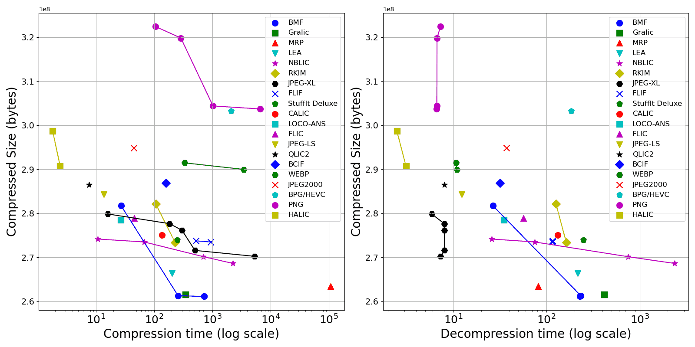

# Gray 8-bit Lossless Photo Compression Benchmark

This repo shows the performance of several state-of-the-art lossless image compression formats/methods when compressing 8-bit grayscale images. Inspired by [24-bit RGB lossless images compression benchmark (LPCB)](http://qlic.altervista.org/) authored by Alex Rhatushnyak.

This benchmark uses <b>62 uncompressed images</b> (total <b>751 MB</b>). To run benchmark, see [RunBench.md](./RunBench.md)

<b>Test Environment</b>: Intel Core i7 12700H, 16GB DDR4 in 3200MHz, Windows 10 system.

  - <b>Win_x64</b>: compressor/decompressor executable file (.exe) is run directly.
  - <b>Linux x64 (WSL)</b>: compressor/decompressor executable file is Linux binary and run in Windows subsystem for Linux (WSL).
  - <b>Python Pillow</b>: use Python 3.9 with <a href="https://pypi.org/project/Pillow/">Pillow</a> 10.1.0 library to run compress/decompress.

　

## Benchmark Result

<i>Note: All shown compressed results are <b>strictly lossless!</b>.</i>

```
Compressed            | Compressed size      |   Compression   |   Decompression  |  Command line                                                              | Command line                                | Test
format/config         | bytes         ratio% |   time, seconds |   time, seconds  |  to compress                                                               | to decompress                               | Environment
----------------------|----------------------|-----------------|------------------|----------------------------------------------------------------------------|---------------------------------------------|-----------------
BMF   (-s -q9)        | 261,105,188   34.75% |     722.372     |     228.101      |  bmf.exe -s -q9 -Oout in.pgm                                               | bmf.exe -pnm -Oout in.bmf                   | Win_x64
BMF   (-s)            | 261,261,936   34.77% |     258.793     |     233.820      |  bmf.exe -s -Oout in.pgm                                                   | bmf.exe -pnm -Oout in.bmf                   | Win_x64
Gralic                | 261,514,961   34.80% |     346.750     |     415.880      |  gralic111d.exe c out.gralic in.ppm                                        | gralic111d.exe d in.gralic out.ppm          | Win_x64
MRP   (-o)            | 262,448,355   34.93% |  549043.153     |      80.030      |  ./encmrp -o in.pgm out.mrp                                                | ./decmrp in.mrp out.pgm                     | Linux x64 (WSL)
MRP                   | 263,367,040   35.04% |  106752.508     |      81.212      |  ./encmrp in.pgm out.mrp                                                   | ./decmrp in.mrp out.pgm                     | Linux x64 (WSL)
LEA                   | 266,334,080   35.44% |     204.655     |     217.282      |  clea.exe in.ppm out.lea                                                   | dlea.exe in.lea out.ppm                     | Win_x64
NBLIC (-e3)           | 268,604,909   35.75% |    2267.025     |    2362.916      |  nblic_codec.exe -c -e3 in.pgm out.nblic                                   | nblic_codec.exe -d in.nblic out.pgm         | Win_x64
NBLIC (-e2)           | 270,138,403   35.95% |     703.554     |     746.253      |  nblic_codec.exe -c -e2 in.pgm out.nblic                                   | nblic_codec.exe -d in.nblic out.pgm         | Win_x64
JPEG-XL (-q 100 -e 9) | 270,223,280   35.96% |    5293.773     |       7.313      |  cjxl.exe in.pgm out.jxl -q 100 -e 9                                       | djxl.exe in.jxl out.pgm                     | Win_x64
JPEG-XL (-q 100 -e 7) | 271,563,265   36.14% |     502.579     |       8.078      |  cjxl.exe in.pgm out.jxl -q 100 -e 7                                       | djxl.exe in.jxl out.pgm                     | Win_x64
RKIM  (cx)            | 273,347,598   36.38% |     230.705     |     163.183      |  rkim.exe cx in.tga out.rkim                                               | rkim.exe e in.rkim out.tga                  | Win_x64
FLIF  (-E100)         | 273,472,210   36.39% |     931.818     |     116.347      |  ./flif -e -N -E100 in.pgm out.flif                                        | ./flif -d in.flif out.pgm                   | Linux x64 (WSL)
NBLIC (-e1)           | 273,488,609   36.40% |      67.102     |      74.424      |  nblic_codec.exe -c -e1 in.pgm out.nblic                                   | nblic_codec.exe -d in.nblic out.pgm         | Win_x64
FLIF  (-E60)          | 273,740,881   36.43% |     522.541     |     116.264      |  ./flif -e -N -E60 in.pgm out.flif                                         | ./flif -d in.flif out.pgm                   | Linux x64 (WSL)
StuffIt Deluxe        | 273,914,871   36.45% |     249.972     |     248.159      |  console_stuffEN.exe /c -o --quiet -a=out in.pgm                           | console_stuffEN.exe /x in                   | Win_x64
NBLIC (-e0 -t)        | 274,203,076   36.49% |      10.712     |      25.786      |  nblic_codec.exe -c -e0 -t in.pgm out.nblic                                | nblic_codec.exe -d in.nblic out.pgm         | Win_x64
CALIC                 | 275,071,904   36.61% |     136.689     |     132.305      |  calic8e.exe in.raw (width) (height) 8 0 out.calic                         | calic8d.exe in.calic out.raw                | Win_x64
JPEG-XL (-q 100 -e 6) | 276,150,100   36.75% |     301.215     |       8.050      |  cjxl.exe in.pgm out.jxl -q 100 -e 6                                       | djxl.exe in.jxl out.pgm                     | Win_x64
JPEG-XL (-q 100 -e 5) | 277,648,911   36.95% |     183.052     |       8.015      |  cjxl.exe in.pgm out.jxl -q 100 -e 5                                       | djxl.exe in.jxl out.pgm                     | Win_x64
LOCO-ANS              | 278,462,660   37.06% |      26.929     |      34.832      |  ./loco_ans_codec 0 in.pgm out.locoans 0                                   | ./loco_ans_codec 1 in.locoans out.pgm       | Linux x64 (WSL)
FLIC                  | 278,838,565   37.11% |      45.525     |      56.748      |  flic.exe c out.flic in.ppm                                                | flic.exe d in.flic out.ppm                  | Win_x64
JPEG-XL (-q 100 -e 3) | 279,843,069   37.24% |      15.978     |       5.885      |  cjxl.exe in.pgm out.jxl -q 100 -e 3                                       | djxl.exe in.jxl out.pgm                     | Win_x64
BMF   (-q9)           | 281,403,408   37.45% |     131.701     |      27.910      |  bmf.exe -q9 -Oout in.pgm                                                  | bmf.exe -pnm -Oout in.bmf                   | Win_x64
BMF                   | 281,729,564   37.49% |      27.015     |      26.590      |  bmf.exe -Oout in.pgm                                                      | bmf.exe -pnm -Oout in.bmf                   | Win_x64
RKIM  (c)             | 282,088,556   37.54% |     106.956     |     126.568      |  rkim.exe c in.tga out.rkim                                                | rkim.exe e in.rkim out.tga                  | Win_x64
JPEG-LS               | 284,310,637   37.84% |      13.719     |      12.316      |  Image.open('in.pgm').save('out.jls',spiff=None)                           | Image.open('in.jls').save('out.pgm')        | Python Pillow
JPEG-LS               | 284,310,637   37.84% |      18.460     |      18.813      |  locoe.exe in.pgm -oout                                                    | locod.exe in out.pgm                        | Win_x64
QLIC2                 | 286,469,836   38.12% |       7.692     |       8.002      |  qlic2.exe c out.qlic2 in.ppm                                              | qlic2.exe d in.qlic2 out.ppm                | Win_x64
BCIF                  | 286,880,232   38.17% |     159.206     |      31.882      |  bcif.exe in.bmp -c out.bcif                                               | bcif.exe in.bcif -d out.bmp                 | Win_x64
LSP                   | 288,349,488   38.37% |      22.712     |      26.903      |  lsp.exe in.pgm                                                            | lsp.exe in.lsp                              | Win_x64
WEBP (-lossless -m 6) | 289,742,674   38.56% |    2015.306     |     138.602      |  cwebp.exe -lossless -q 100 -m 6 in.png -o out.webp                        | dwebp.exe in.webp -o out.pgm                | Win_x64
WEBP (-lossless -m 6) | 289,966,290   38.59% |    3460.702     |      10.958      |  Image.open('in.pgm').save('out.webp',lossless=True,quality=100,method=6)  | Image.open('in.webp').save('out.pgm')       | Python Pillow
HALIC                 | 290,744,703   38.69% |       2.429     |       3.116      |  HALIC_ENCODE_V.0.7.2_ST_AVX.exe in.pgm out                                | HALIC_DECODE_V.0.7.2_ST_AVX in out.pgm      | Win_x64
WEBP (-lossless -m 4) | 291,422,842   38.78% |     358.133     |     137.990      |  cwebp.exe -lossless -q 100 -m 4 in.png -o out.webp                        | dwebp.exe in.webp -o out.pgm                | Win_x64
WEBP (-lossless -m 4) | 291,450,516   38.79% |     333.802     |      10.727      |  Image.open('in.pgm').save('out.webp',lossless=True,quality=100,method=4)  | Image.open('in.webp').save('out.pgm')       | Python Pillow
BIM                   | 291,820,569   38.84% |      60.972     |      59.642      |  bim.exe c in.ppm out.bim                                                  | bim.exe d in.bim out.ppm                    | Win_x64
JPEG2000              | 294,836,093   39.24% |      44.764     |      37.418      |  Image.open('in.pgm').save('out.j2k',format='JPEG2000',irreversible=False) | Image.open('in.j2k').save('out.pgm')        | Python Pillow
HALIC (FAST)          | 298,660,889   39.75% |       1.809     |       2.493      |  HALIC_ENCODE_V.0.7.2_ST_FAST_AVX.exe in.pgm out                           | HALIC_DECODE_V.0.7.2_ST_FAST_AVX in out.pgm | Win_x64
BPG/HEVC              | 303,248,314   40.36% |    2119.629     |     184.144      |  bpgenc.exe -lossless -e jctvc -m1 -o out.bpg in.png                       | bpgdec.exe -o out.png in.bpg                | Win_x64
PNG   (optipng -o7)   | 303,703,031   40.42% |   17779.304     |       6.798      |  optipng.exe -o7 -force in.pgm -out out.png                                | nconvert.exe -out pgm -o out.pgm in.png     | Win_x64
PNG   (optipng -o5)   | 303,703,031   40.42% |    6603.849     |       6.618      |  optipng.exe -o5 -force in.pgm -out out.png                                | nconvert.exe -out pgm -o out.pgm in.png     | Win_x64
PNG   (optipng -o2)   | 304,379,777   40.51% |    1028.626     |       6.682      |  optipng.exe -o2 -force in.pgm -out out.png                                | nconvert.exe -out pgm -o out.pgm in.png     | Win_x64
LPAQ8 (9)             | 309,500,383   41.19% |    1177.094     |     923.235      |  lpaq8.exe 9 in.pgm out.lpaq8                                              | lpaq8.exe d in.lpaq8 out.pgm                | Win_x64
PNG   (pngout)        | 315,139,201   41.93% |    4425.092     |       7.073      |  pngout.exe /c0 /f5 in.png                                                 | nconvert.exe -out pgm -o out.pgm in.png     | Win_x64
PNG   (clevel=9)      | 319,812,204   42.56% |     288.735     |       6.713      |  nconvert.exe -out png -clevel 9 -o out.png in.pgm                         | nconvert.exe -out pgm -o out.pgm in.png     | Win_x64
PNG   (clevel=6)      | 322,413,447   42.91% |     106.142     |       7.303      |  nconvert.exe -out png -clevel 6 -o out.png in.pgm                         | nconvert.exe -out pgm -o out.pgm in.png     | Win_x64
PNG   (clevel=2)      | 368,803,484   49.08% |      18.301     |       7.452      |  nconvert.exe -out png -clevel 2 -o out.png in.pgm                         | nconvert.exe -out pgm -o out.pgm in.png     | Win_x64
XZ    (-9 --extreme)  | 378,068,772   50.31% |     422.718     |      36.415      |  xz -zk -9 --extreme in.pgm                                                | xz -dk in.pgm.xz                            | Linux x64 (WSL)
Gzip  (-9)            | 459,102,381   61.40% |      74.900     |      13.929      |  gzip -k -9 in.pgm                                                         | gzip -dk in.pgm.gz                          | Linux x64 (WSL)
(uncompressed)        | 751,411,774   100.0% |                 |                  |                                                                            |                                             |
```

　



　

　

## compression formats/methods

There are 20+ compression formats/methods that participated in this benchmark:

- <b>BMF</b> (v2.01) is a closed-sourced lossless image format by Dmitry Shkarin.
    The compressor/decompressor used in this test is as same as the BMF2.01 used in <a href="http://qlic.altervista.org/">24-bit RGB LPCB</a>.
- <b>Gralic</b> (v1.11d) is closed-sourced lossless image format by Alex Rhatushnyak.
    The compressor/decompressor used in this test is as same as the Gralic1.11d used in <a href="http://qlic.altervista.org/">24-bit RGB LPCB</a>.
    I've contact the author of Gralic and report this issue.</i>
- <b>FLIC</b> (v2.1d) and <b>QLIC2</b> (v2.d) by Alex Rhatushnyak. Same as the one used in <a href="http://qlic.altervista.org/">24-bit RGB LPCB</a>.
- <b><a href="https://encode.su/threads/3818-LEA-Lossless-image-compressor">LEA</a></b> (v0.6 beta) by Marcio Pais.
    <i>If their links expire, just search them in <a href="https://encode.su">encode.su</a></i> .
- <b><a href="https://encode.su/threads/4025-HALIC-(High-Availability-Lossless-Image-Compression)">HALIC</a></b> (0.7.2) by Hakan Abbas.
    You can get HALIC 0.7.2 <a href="https://github.com/Hakan-Abbas/HALIC-High-Availability-Lossless-Image-Compression-/releases/tag/0.7.2">here</a>.
- <b>NBLIC</b> (v0.3) is a open-sourced lossless image format by <a href="https://github.com/WangXuan95">Xuan Wang</a>.
    The NBLIC compressor/decompressor is from <a href="https://github.com/WangXuan95/NBLIC-Image-Compression">github.com/WangXuan95/NBLIC-Image-Compression</a>.
- <b>MRP</b> (v0.5) by Ichiro Matsuda et. al. is a interesting gray 8-bit compression format. [<a href="https://ieeexplore.ieee.org/document/7078076/">MRP paper</a>]
    It gets a high compression ratio and decodes fast, but it encodes very slow.
    You can get MRP v0.5 <a href="https://www.rs.tus.ac.jp/matsuda-lab/matsuda/mrp/index.html">here</a>.
    <i>Note: Since MRP only supports images that can be divided by 8 in length and width, I wrote a Python program to pad the image to a multiple of 8, see <a href="https://github.com/WangXuan95/Gray8bit-Image-Compression-Benchmark">github.com/WangXuan95/Gray8bit-Image-Compression-Benchmark</a></i>
- <b>RKIM</b> (v1.06) is a closed-sourced lossless image format by Malcolm Taylor.
    The compressor/decompressor used in this test is as same as the RKIM1.05 used in <a href="http://qlic.altervista.org/">24-bit RGB LPCB</a>.
- <b>JPEG-XL</b> (v0.9.0) is a standard image format that support lossless.
    The JPEG-XL encoder/decoder can be found <a href="https://github.com/libjxl/libjxl/releases">here</a>.
- <b>FLIF</b> (v0.4) is a open-sourced lossless image format by Jon Sneyers and Pieter Wuille, which is incorporated into JPEG-XL standard.
    The FLIF compressor/decompressor is from <a href="https://github.com/FLIF-hub/FLIF">github.com/FLIF-hub/FLIF</a>.
- <b>CALIC</b> is a lossless image compressor by Xiaolin Wu. [<a href="https://ieeexplore.ieee.org/document/585919">CALIC paper</a>]
    You can get CALIC executable file in <a href="https://www.ece.mcmaster.ca/~xwu/">Xiaolin Wu's homepage</a>.
- <b>LOCO-ANS</b> is a open-sourced lossless image compressor by Tobias Alonso et al.
    which can be found at <a href="https://github.com/hpcn-uam/LOCO-ANS">github.com/hpcn-uam/LOCO-ANS</a>.
- <b>LSP</b> is a open-sourced lossless image format, as same as the one tested in <a href="http://qlic.altervista.org/">24-bit RGB LPCB</a>.
- <b>BCIF</b> (v1.0 beta) by Stefano Brocchi and <b>BIM</b> (v0.03) by Ilya Muravyov. Same as the one used in <a href="http://qlic.altervista.org/">24-bit RGB LPCB</a>.
- <b>JPEG-LS</b> is a standard lossless image format. Two methods are used to encode/decode WEBP:
    - Python 3.9.13 with Pillow 10.1.0 and <a href="https://pypi.org/project/pillow-jpls/">pillow_jpls</a> Library, which is based on <a href="https://github.com/team-charls/charls">charLS</a> JPEG-LS C++ library.
    - the encoder/decoder from <a href="http://www.stat.columbia.edu/~jakulin/jpeg-ls/mirror.htm">UBC's JPEG-LS public code</a>.
- <b>WEBP</b> is a standard image format. Two methods are used to encode/decode WEBP:
    - Python 3.9.13 with Pillow 10.1.0 Library in Win_x64. (it decodes faster!)
    - the executable file as same as the one used in <a href="http://qlic.altervista.org/">24-bit RGB LPCB</a>.
- <b>PNG</b> is a standard image format. Three methods are used to compress PNG:
    - Regular PNG compression using <a href="https://www.xnview.com/en/nconvert/#downloads">NConvert 7.163</a>.
    - Optimized PNG compressor <a href="https://optipng.sourceforge.net/">OptiPNG 0.7.7</a> by Cosmin Truta.
    - Optimized PNG compressor <a href="http://www.advsys.net/ken/utils.htm">PNGOUT</a> by Ken Silverman.
- <b>JPEG2000</b> is a standard image format.
    This test use Python 3.9.13 with Pillow 10.1.0 Library in Win_x64 to compress/decompress JPEG2000.
- <b>StuffIt Deluxe</b> (tested version:13.0.0.24 (2009)) can be found at <a href="https://stuffit.com/">stuffit.com</a>, which is also tested in <a href="http://qlic.altervista.org/">24-bit RGB LPCB</a>.
    <i>Note: StuffIt 2010 (v14.0.0.16) supports "--recompression-level=2" option to improve compression ratio.
    However, I cannot find the corresponding command-line tool (console_stuffEN.exe) in this version.
    Perhaps I will figure it out later.</i>
- <b><a href="https://tukaani.org/xz/">XZ</a></b> (<a href="https://www.7-zip.org/">LZMA2</a>) and <b>Gzip</b> (deflate) are two famous generic data compression formats,
    but not specifically designed for compressing images.
    Here we include them just for reference.
- <b><a href="https://cs.fit.edu/~mmahoney/compression/#lpaq">LPAQ8</a></b> by Matt Mahoney and Alex Ratushnyak is a generic data compression algorithm which gets high compression ratio.

There are also some formats to be added in the future:

- <b>AVIF</b> lossless and <b>WEBP2</b> lossless.
- <b>PAQ8IM, PAQ8PX, and CMIX</b> in <a href="http://qlic.altervista.org/">24-bit RGB LPCB website</a>.
    <i>Note: I haven't add them yet since their compression/decompression takes a very long time (several days).</i>
